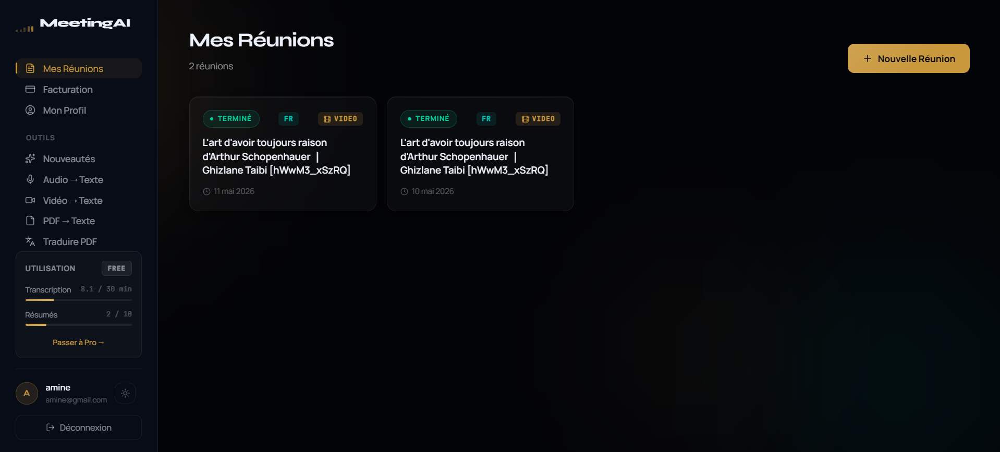
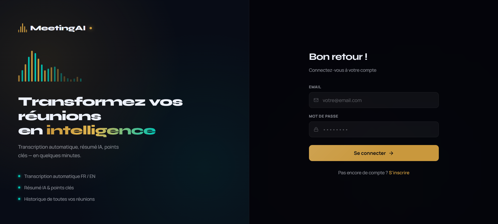
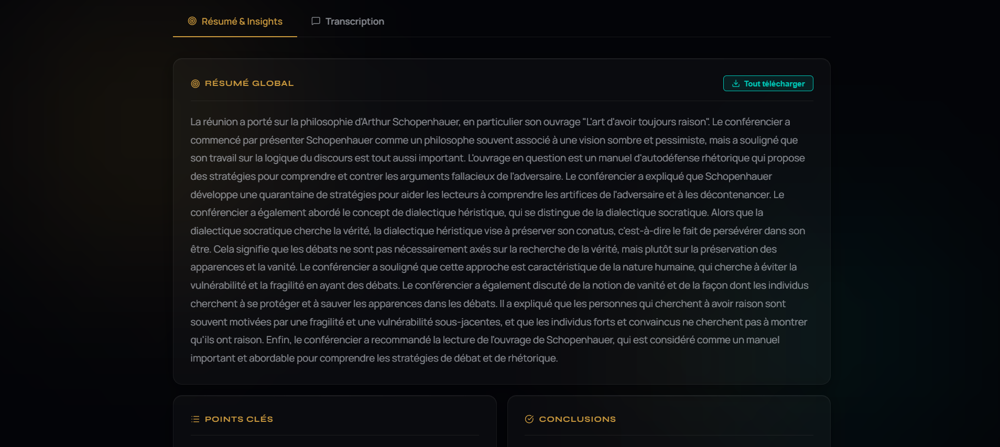
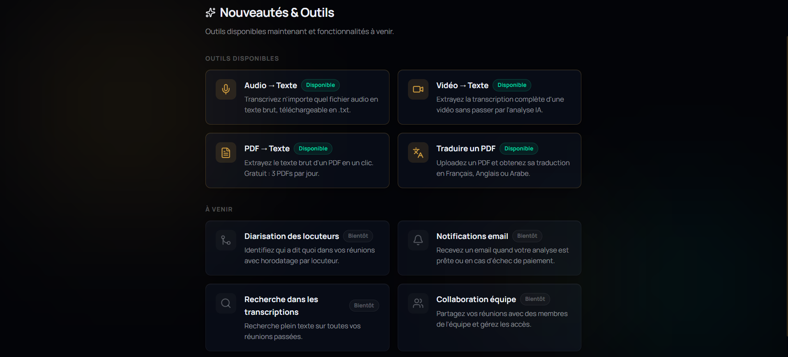
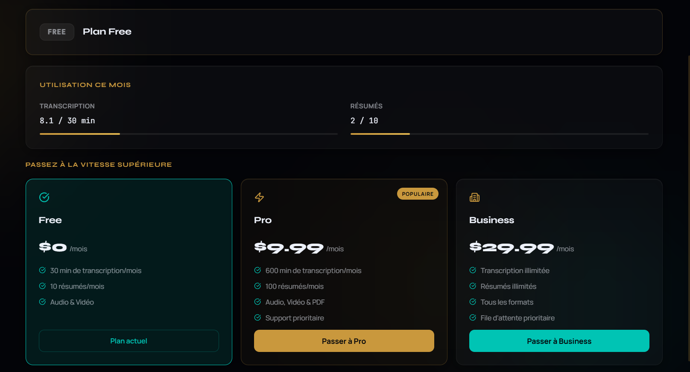
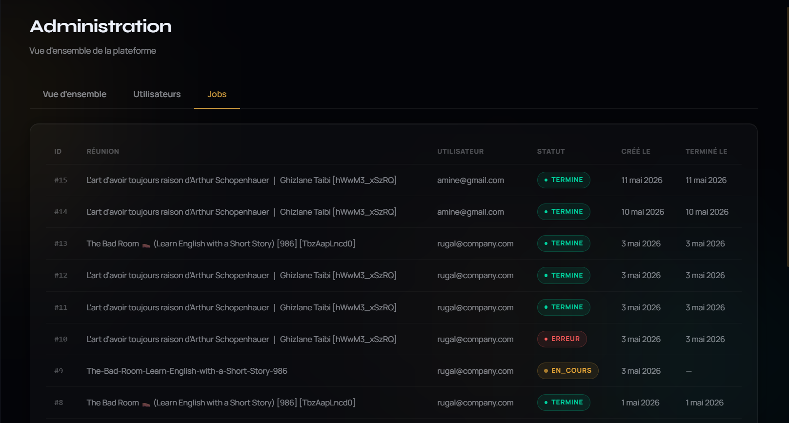

# MeetingAI

> AI-powered meeting assistant that transcribes audio/video, summarizes PDFs, and extracts key insights — built as a production-grade SaaS with Stripe billing and usage limits.


<!-- TODO: replace with actual screenshot -->

---

## Features

- **Audio & Video Transcription** — Upload any meeting recording (MP3, MP4, WAV, MKV…) and get a full transcript powered by [faster-whisper](https://github.com/SYSTRAN/faster-whisper)
- **AI Summarization** — Automatic 3–5 paragraph summary, 8–12 key points, and 5–8 conclusions via Groq LLaMA 3.3 70B
- **PDF Analysis** — Upload meeting documents or reports for instant AI-generated insights
- **Standalone Tools** — Audio→Text, Video→Text, PDF→Text, and PDF translation (EN / FR / AR)
- **Stripe Billing** — Free, Pro ($9.99/mo), and Business ($29.99/mo) plans with usage enforcement
- **Admin Dashboard** — User management, job monitoring, and revenue stats
- **Dark-theme UI** — React 19 + Framer Motion (NEXUS Design System)

---

## Screenshots

### Login & Sign Up

<!-- TODO: replace with actual screenshot -->

### Dashboard — File Upload & Meeting History

<!-- TODO: replace with actual screenshot -->

### Meeting Detail — Transcript & Summary

<!-- TODO: replace with actual screenshot -->

### Standalone Tools

<!-- TODO: replace with actual screenshot -->

### Billing & Plans

<!-- TODO: replace with actual screenshot -->

### Admin Dashboard

<!-- TODO: replace with actual screenshot -->

---

## Architecture

Three services that run simultaneously:

```
Frontend (React/Vite)  ←→  Backend (FastAPI)  ←→  AI Service (FastAPI)
     :5173                      :8080                    :8000
```

| Layer | Stack | Directory |
|-------|-------|-----------|
| Frontend | React 19 + TypeScript + Vite + Framer Motion | `Frontend/` |
| Backend | FastAPI + SQLAlchemy + SQLite + JWT + Stripe | `Backend_FastAPI/` |
| AI Service | FastAPI + faster-whisper + Groq API + pdfplumber | `Ai_Service/` |

---

## Prerequisites

| Requirement | Version |
|-------------|---------|
| Node.js | 18+ |
| Python (Backend) | 3.10+ |
| Python (AI Service) | **3.10 exactly** (required for torch/CUDA) |
| FFmpeg | Any recent version — must be on PATH |
| GPU (recommended) | CUDA-capable (tested on RTX 3070 8 GB) |

> **Windows users:** Before first run, set your paging file to at least 30 000 MB on a fast drive. Whisper needs it for long recordings.

---

## Getting Started

### 1. Clone the repo

```bash
git clone https://github.com/YOUR_USERNAME/meetingai-mvp.git
cd meetingai-mvp
```

### 2. AI Service setup

```bash
cd Ai_Service
python -m venv venv          # must be Python 3.10
.\venv\Scripts\activate      # Windows
# source venv/bin/activate   # macOS/Linux

pip install -r requirements.txt

cp .env.example .env
# fill in GROQ_API_KEY
```

### 3. Backend setup

```bash
cd ../Backend_FastAPI
python -m venv venv
.\venv\Scripts\activate

pip install -r requirements.txt

cp .env.example .env
# fill in JWT_SECRET, STRIPE_* keys (see .env.example)
```

### 4. Frontend setup

```bash
cd ../Frontend
npm install

cp .env.example .env.local
# fill in VITE_STRIPE_PRO_PRICE_ID, VITE_STRIPE_BUSINESS_PRICE_ID
```

---

## Running Locally

Open **three terminals** and start each service in order:

```bash
# Terminal 1 — AI Service (start first, Whisper loads at import)
cd Ai_Service && .\venv\Scripts\activate
uvicorn app.main:app --reload
# → http://localhost:8000

# Terminal 2 — Backend
cd Backend_FastAPI && .\venv\Scripts\activate
uvicorn app.main:app --reload --port 8080
# → http://localhost:8080

# Terminal 3 — Frontend
cd Frontend
npm run dev
# → http://localhost:5173
```

Interactive API docs: http://localhost:8080/docs

---

## Environment Variables

### `Backend_FastAPI/.env`

```env
JWT_SECRET=your-secret-key
DATABASE_URL=sqlite:///./meetingai.db

STRIPE_SECRET_KEY=sk_live_...
STRIPE_PUBLISHABLE_KEY=pk_live_...
STRIPE_WEBHOOK_SECRET=whsec_...
STRIPE_PRO_PRICE_ID=price_...
STRIPE_BUSINESS_PRICE_ID=price_...

AI_SERVICE_URL=http://localhost:8000
FRONTEND_URL=http://localhost:5173
```

### `Ai_Service/.env`

```env
GROQ_API_KEY=gsk_...
```

### `Frontend/.env.local`

```env
VITE_STRIPE_PRO_PRICE_ID=price_...
VITE_STRIPE_BUSINESS_PRICE_ID=price_...
```

---

## Plans & Pricing

| Plan | Price | Transcription | Summaries | PDF Tools |
|------|-------|--------------|-----------|-----------|
| Free | $0 | 30 min / month | 10 / month | 3 extractions / day |
| Pro | $9.99 / month | 600 min / month | 100 / month | Unlimited |
| Business | $29.99 / month | Unlimited | Unlimited | Unlimited |

---

## Stripe Webhooks (local dev)

```bash
stripe listen --forward-to localhost:8080/api/billing/webhook
```

Handled events: `checkout.session.completed`, `customer.subscription.updated`, `customer.subscription.deleted`, `invoice.payment_succeeded`, `invoice.payment_failed`.

---

## Admin Access

Grant admin rights directly in the SQLite database:

```bash
sqlite3 Backend_FastAPI/meetingai.db \
  "UPDATE utilisateurs SET role='admin' WHERE email='you@example.com';"
```

The admin dashboard is available at `/admin` after login.

---

## Supported File Types

| Type | Extensions | Max Size |
|------|-----------|---------|
| Audio | mp3, wav, m4a, ogg, flac | 500 MB |
| Video | mp4, mov, mkv, webm, avi | 500 MB |
| PDF | pdf | 50 MB |
| Text | txt | 500 MB |

> Scanned / image-only PDFs are not supported (no OCR).

---

## Tech Stack

**Frontend**
- React 19, TypeScript, Vite
- Framer Motion, Axios

**Backend**
- FastAPI, SQLAlchemy, SQLite (→ PostgreSQL for production)
- python-jose (JWT), bcrypt, slowapi (rate limiting)
- Stripe SDK, httpx

**AI Service**
- faster-whisper (medium, int8, CUDA)
- Groq API — LLaMA 3.3 70B
- pdfplumber, FFmpeg

---

## Roadmap

- [ ] PostgreSQL migration (replace SQLite)
- [ ] Celery + Redis job queue (replace BackgroundTasks)
- [ ] Email notifications (job completed, payment failed)
- [ ] Speaker diarization
- [ ] Darija (Moroccan Arabic) support
- [ ] Production deployment (Railway / Render / AWS)

---

## License

MIT
